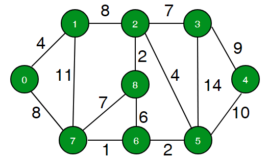
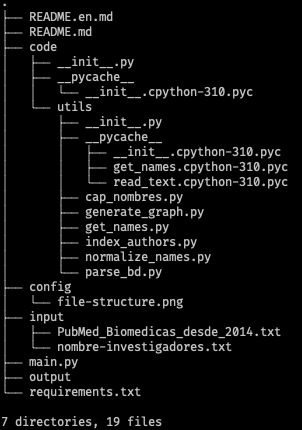

# Support for the development of software infrastructure for the Ministry of Education

[](https://github.com/FernandoBarrz/autores-grafo-SS/)         Spanish 👈
## About the project
> A command line app that automates the process of registering collaboration between authors' research work in the form of a graph (data structure). This app uses some input files containing researchers' names from the institute and the bibliographic information gathered from published materials and then it process it to generate a undirected weighted graph representing those collaborations.

    * Created Graph, Vertex and Edge classes for representing graphs.  
    * Added an ability to display graph image by using pydot, graphviz and PIL(Python Image Library).

__Project for the [Biomedical Research Institute](https://www.biomedicas.unam.mx/)__



---
### Built With
* Pytohn 3.6+
----

## Table of contents
Contents
1. [Get Started](#getting-started)
    * [Project Structure](#project-structure)
2. [Installation](#installation)
3. [Prerequisites](#prerequisites)
    * Optional Dependencies
5. [Usage](#usage)
6. [Contact](#contact)

----
# Getting Started

## Project Structure 


### Project directories and files:
* __code/__ 
    * _Contains the main source code_
    * __utils/__
        * _Contains the packages and modules used by the program_
* __config/__
* __input/__
    * _Contains the .txt files with the authors' names and the publication's data._
* __output/__
    * _Contains a .txt file auto generated from the data. Representing the collaborations. Optionally a PDF also can be generated_
----

## Installation

1. Clone the repo
    ```bash
    git clone https://github.com/FernandoBarrz/autores-grafo-SS.git
    ```
3. Change directory to the project root directory.
    ```bash
    cd autores-grafo-ss/
    ```
2. Override the _.txt_ file in the __/input__ directory (if necessary).
---
### Dependencies (_Optional_)
> The requirements.txt file contains the required dependencies' version and name to run the app.

* Make sure to meet the requirements (see next section)

```bash
pip install -r requirements.txt
```

## Prerequisites
* Python 3.6+ Installed
* PIP 3 installed
    * Installing pip for Python 3
        * To install pip for Python 3 on Ubuntu 20.04 run the following commands as root or sudo user in your terminal:
            ```bash
                sudo apt update
                sudo apt install python3-pip
            ```
    * Or, use a virtual environment with __venv__
        * Install the _python3-venv_ package that provides the venv module.
            * On Unix/Linux
                ```bash
                sudo apt install python3-venv
                ```
        * Create a Virtual Environment:
        ```bash
            python3 -m venv <project-name>
        ```
        * Activate venv
        ```bash
            source <project-name>/bin/activate
            python3 -m pip install --upgrade pip
        ```
* (__OPTIONAL dependency__)
    * __Graphviz__ (Python library to work with graphs) source code
        * Linux Distros:
            ```bash 
                sudo apt-get install graphviz
            ```
        * On MacOS X
            ```bash
                brew install graphviz
            ```

## Usage
1.  To use the command line app on your computer, execute the main_en.py file. 

    On a Linux/UNIX based OS:
    ```sh
    python3 main_en.py
    ```
    On Windows OS
    ```sh
    py main_en.py
    ```
2. The select option by typing a number from the options menu.
3. If the option 4 is selected, then a image (.jpg) is saved in the __"output/"__ directory.

---


## Example of usage

### Create a graph instance

```python
from graph import Graph
graph = Graph() # Graph(directed=false) for undirected graph
```

### Add vertices

```python
graph.add_vertex("New York")
graph.add_vertex("Bratislava")
graph.add_vertex("Kyiv")
graph.add_vertex("Warsaw")
graph.add_vertex("Atlanta")
```

### Add edges

```python
graph.add_edge("New York", "Bratislava", 7)
graph.add_edge("Bratislava", "Warsaw", 3)
graph.add_edge("Warsaw", "New York", 12)
graph.add_edge("Warsaw", "Kyiv", 5)
graph.add_edge("Kyiv", "Bratislava", 4)
graph.add_edge("Atlanta", "Kyiv", 11)
```

### Remove vertex

```python
graph.remove_vertex("Atlanta")
```

### Remove edge

```python
graph.remove_edge("Atlanta", "Kyiv", 11)
```

### Get all neighbours and edge's weight to them

```python
# get Kyiv vertex and all outbound edges
vertex = graph.get_vertex("Kyiv")
outbound_edges = vertex.get_outbound_edges()

# iterate over outbound edges and get end vertex
for edge in outbound_edges:
  neighbour = edge.get_end_vertex()
  weight = edge.get_weight()
```

### Display graph

```python
from graph import display_graph
display_graph(graph, "Graph name")
```


---
## Contact

Fernando Barrios - [/in/fernando-barrios/](https://www.linkedin.com/in/fernando-barrios/) - fernando.barrios.dev@gmail.com

Project Link: [https://github.com/FernandoBarrz/autores-grafo-SS](https://github.com/FernandoBarrz/autores-grafo-SS)

------

## License

Distributed under the MIT License. 
