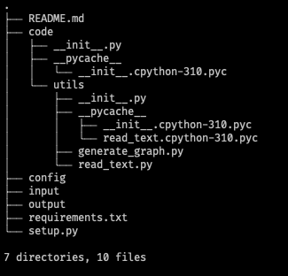

# Apoyo para el desarrollo de infraestructura de software para la Secretaría de Enseñanza

_Proyecto para el Instituto de Investigaciones Biomédicas_

---
## Tabla de contenidos
1. [Comenzando](#comenzando)
    * [Pre-requisitos](#pre-requisitos)
2. [Estructura del proyecto](#estructura)
3. [Guía de Instalación](#guía-de-Instalación)
    * [Dependencias](#instalación-de-dependencias)
5. [Ejecutando el programa](#ejecutando-el-programa)

----
## Comenzando
* ...
* ...
* ...

### Pre-requisitos
* Python 3.6+
* ...
* ...

## Estructura


Carpetas del proyecto:
* __code/__ 
    * _Contiene el código fuente del proyecto_
    * __utils/__
        * _Contiene los paquetes y librerias que utiliza el programa_
* __config/__
* __input/__
* __output/__

## Guía de Instalación
### Instalación
* Descargar la carpeta del proyecto.
* Mover el archivo
* ...

```bash
$ python3 setup.py

```

---
### Instalación de dependencias
> En el archivo requirements.txt contiene el nombre y la versión de las dependencias necesarias para la ejecución de la aplicación
```sh
pip install -r requirements.txt

```
## Ejecutando el programa
Instrucciones para ejecutar el programa

------

```txt
Barrios Ramírez Luis Fernando
Licenciatura en Informática
Facultad de Contaduría y Administración
Universidad Nacional Autónoma de México
```